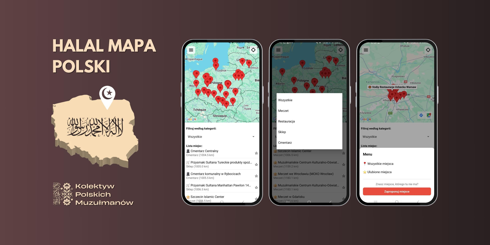

# Halal Mapa Polski



## Desciption / Opis

**EN**

Halal Mapa Polski is a free and open-source simple mobile app that lets users find places related to Islam in Poland.
It is not always easy to find these places around you, and many places in Poland do not advertise catering to Muslims (or being halal) online or on Google Maps.
This app intends to list these places by gathering information from users, who can propose a new place to be added, and from contributors from Kolektyw Polskich Muzułmanów (collective of Polish Muslims), who created this project.

**PL**

Halal Mapa Polski to prosta aplikacja mobilna, będąca wolnym i otwartym oprogramowaniem, umożliwiająca użytkownikom znalezienie miejsc związanych z Islamem w Polsce.
Nie zawsze jest łatwo znaleźć takie miejsca wokół siebie. Wiele miejsc nie reklamuje się jako miejsca dla Muzułmanów (bądź będące halal) w internecie lub na mapach Google.
Aplikacja ma na celu zbudowanie listy takich miejsc poprzez zbieranie informacji od użytkowników, którzy mogą zaproponować nowe miejsce oraz od członków Kolektywu Polskich Muzułmanów, którzy założyli ten projekt.

## Instalation / Instalacja

iOS:

[](https://apps.apple.com/app/id6756282374)

Android:

**EN** Currently we are doing closed testing. If you want to help us with testing, please join using the [link](https://docs.google.com/forms/d/e/1FAIpQLSd-YU-aKWvsn8uvIBkPqEYa-G1KlPz42AbqW0vw-549r2tFgw/viewform)

**PL** Obecnie prowadzimy zamknięte testy. Jeżeli chcesz nam pomóc, proszę dołącz używając [linku](https://docs.google.com/forms/d/e/1FAIpQLSd-YU-aKWvsn8uvIBkPqEYa-G1KlPz42AbqW0vw-549r2tFgw/viewform)

## Current version / Obecna wersja 

**EN**

The current version of the app is very simple, presenting only basic features. This involves a map with places, a basic filtering feature, favorite places, location services, and proposing new places.

**PL**

Obecna wersja jest bardzo podstawowa, posiada ona tylko proste funkcje. W tym mapę z miejscami, lokalizacje użytkownika, ulubione miejsca i możliwość proponowania nowych miejsc.

## Future plans / Przyszłe plany

**EN**

The app is ready for the first version release, as the need for the app in the community is somewhat high. Development will continue once the usefulness and interest are tested in practice.

Our rough goals for the future development include:
1. Better look and UI with proper styles
2. Online shops section for shops based in Poland or with convenient delivery in Poland
3. Adding a page for each place with a description and potentially a review system
4. English language support (and any other language, if there is a need in the community)

**PL**

Aplikacja jest gotowa do wydania w pierwszej wersji, z powodu zapotrzebowania w społeczności. Rozwijanie aplikacji będzie kontynuowane, jak aplikacja spotka się z zainteresowaniem.

Generalne plany dalszego rozwoju:
1. Lepszy wygląd i UI
2. Sekcje sklepów online, ze sklepami bazującymi w Polsce bądź oferujące dobre dostawy do Polski
3. Dodanie strony każdego miejsca, wraz z opisami tych miejsc i możliwymi opiniami użytkowników
4. Dodanie języka angielskiego (bądź innych języków, zależnie od zapotrzebowania w społeczności)

## Contributing / współtworzenie

**EN**

We welcome contributions in various forms, including:
1. Reporting issues in the issues tab
2. Adding new places using the Google Forms in the app or under this [link](https://docs.google.com/forms/d/e/1FAIpQLSfo_VYwGFPhDV0q1kwJXcy9lhJFMgnCq4c7p-9bv50IPse9qg/viewform)
3. Contributing to the code

We are very thankful for all contributions!

**PL**

Chętnie przyjmiemy wsparcie w różnej postaci:
1. Raportowanie problemów w sekcji "issues"
2. Dodawanie nowych miejsc używając Google Forms w aplikacji bądź pod tym [linkiem](https://docs.google.com/forms/d/e/1FAIpQLSfo_VYwGFPhDV0q1kwJXcy9lhJFMgnCq4c7p-9bv50IPse9qg/viewform)
3. Współtworzenie kodu

Za każdą pomoc dziękujemy!

## Development

The app uses EXPO platform to create a single React Native app, building for both Android and iOS. Development builds are required to test the app, as the project uses custom code not hanndled inside Expo Go app.
This makes contributing harder, as contributors need to build development builds using their own EXPO project and Google API keys.

Prerequisites:
1. Node.js
2. npm
3. expo-cli
4. Expo Go app on a mobile device or Android Studio emulator

Setup after cloning the repository:
1. Create EXPO project. You can read more about it [here](https://docs.expo.dev/tutorial/create-your-first-app/)
2. Create Google Project and API keys for Google Maps SDK. More about it [here](https://developers.google.com/maps/documentation/android-sdk/overview?section=start)
3. Configure app.config.js with your projectID and Google Maps SDK API key

How to build:

1. Run from inside the repository to install the third-party packages

```
npm install 
```

2. Build development builds. You might be asked to log in to your project beforehand

```
eas build --platform android --profile development
eas build --platform ios --profile development
```

3. Start expo server

```
npx expo start
```

## Acknowledgements / Podziękowania

**EN**

We would like to thank all the contributors to the project. Kolektyw Polskich Muzułmanów (Polish Muslims Collective) for fundraising for costs of publishing the project. Individual members for contributions and support.
Member who took publishing under their name on the app stores. As well as contributors to the code.

Special thanks to all the people providing information about places we list in the app.

Moreover, we would like to thank all the free and open-source developers for creating software and infrastructure allowing us to create this app.
For third-party acknowledgments, see the appropriate section of the app or [here](public/licenses.md)

**PL**

Chcielibyśmy podziękować wszystkim współtwórcom projektu. Kolektywowi Polskich Muzułmanów za zebranie środków na publikacje projektu. Indywidualnym członkom za wsparcie i pomoc.
Członkowi, który użyczył swojego imienia w celu dystrybucji projektu. Oraz wszystkim współtwórcom kodu.

Specjalne podziękowania wszystkim osobom, które przekazały informacje o miejscach wylistowanych w aplikacji.

Dodatkowo chcielibyśmy podziękować całej społeczności wolnego i otwartego oprogramowania za tworzenie oprogramowania i infrastruktury umożliwiającej nam zrobienie tej aplikacji.
Informacje komponentach tworzonych przez inne osoby można znaleźć w odpowiedniej sekcji aplikacji, bądź [tutaj](public/licenses.md)

## Copyright

**EN**

Halal Mapa Polski — v0.1.0
Copyright © 2025-2026 Kolektyw Polskich Muzułmanów

This program is free software: you can redistribute it and/or modify
it under the terms of the GNU General Public License as published by
the Free Software Foundation, either version 3 of the License, or
(at your option) any later version.

This program is distributed in the hope that it will be useful,
but WITHOUT ANY WARRANTY; without even the implied warranty of
MERCHANTABILITY or FITNESS FOR A PARTICULAR PURPOSE. See the GNU
General Public License for more details.

You should have received a copy of the GNU General Public License
along with this program. If not, see https://www.gnu.org/licenses/.

All original visual designs, layouts, branding elements, name "Halal Mapa Polski"
and compositions presented in this app are copyrighted by © 2025-2026 Kolektyw Polskich
Muzułmanów. They are not covered by the GPL license and may not be reused without
permission from their rightful owner.

Some visual materials within this app incorporate assets licensed from third-party
providers such as Depositphotos. These materials have been modified and integrated
into original derivative works created by Kolektyw Polskich Muzułmanów. Copyright
in the original stock materials remains with their respective owners; copyright in
the derivative compositions belongs to Kolektyw Polskich Muzułmanów.

Certain design elements (such as icons, images, and templates) were sourced from
Canva and are used under Canva’s Free Content License and/or Pro Content License,
as applicable. These elements remain the intellectual property of their respective
creators and licensors.

This app uses Google Maps SDK for Android/iOS © Google LLC. Used under license. Google
Maps data and imagery are subject to Google’s Terms of Service.

**PL**

Halal Mapa Polski — v0.1.0
Copyright © 2025-2026 Kolektyw Polskich Muzułmanów

Ten program jest wolnym oprogramowaniem: możesz go rozprowadzać dalej i/lub modyfikować
na warunkach Powszechnej Licencji Publicznej GNU, wydanej przez Free Software Foundation,
w wersji 3 tej Licencji lub (według twojego wyboru) dowolnej późniejszej wersji.

Ten program jest rozpowszechniany z nadzieją, że będzie użyteczny,
ale BEZ JAKIEJKOLWIEK GWARANCJI; nawet bez domniemanej gwarancji
PRZYDATNOŚCI HANDLOWEJ albo PRZYDATNOŚCI DO OKREŚLONEGO CELU.
Więcej szczegółów znajdziesz w Powszechnej Licencji Publicznej GNU.

Kopia Powszechnej Licencji Publicznej GNU powinna być dołączona do tego programu.
Jeśli nie, zobacz: https://www.gnu.org/licenses/
        
Wszystkie oryginalne projekty wizualne, układy, elementy brandingu, nazwa
"Halal Mapa Polski" i kompozycje prezentowane w tej aplikacji są objęte prawami
autorskimi © 2025-2026 Kolektyw Polskich Muzułmanów. Nie są one objęte Powszechną
Licencją Publiczną GNU i nie mogą być wykorzystywane bez zgody właściciela.

Niektóre materiały wizualne w tej aplikacji zawierają zasoby licencjonowane od
zewnętrznych dostawców, takich jak Depositphotos. Materiały te zostały
zmodyfikowane i zintegrowane z oryginalnymi dziełami pochodnymi stworzonymi przez
Kolektyw Polskich Muzułmanów. Prawa autorskie do oryginalnych materiałów
stockowych należą do ich odpowiednich właścicieli; prawa autorskie do kompozycji
pochodnych należą do Kolektyw Polskich Muzułmanów.

Niektóre elementy projektu (takie jak ikony, obrazy i szablony) pochodzą z serwisu
Canva i są wykorzystywane na podstawie licencji Canva Free Content License i/lub
licencji Pro Content License, w zależności od przypadku. Elementy te pozostają
własnością intelektualną ich twórców i licencjodawców.

Ta aplikacja wykożystuje Google Maps SDK for Android/iOS © Google LLC. Wykorzystywane
na podstawie licencji. Dane i obrazy map Google podlegają Warunkom korzystania z
usług Google.
